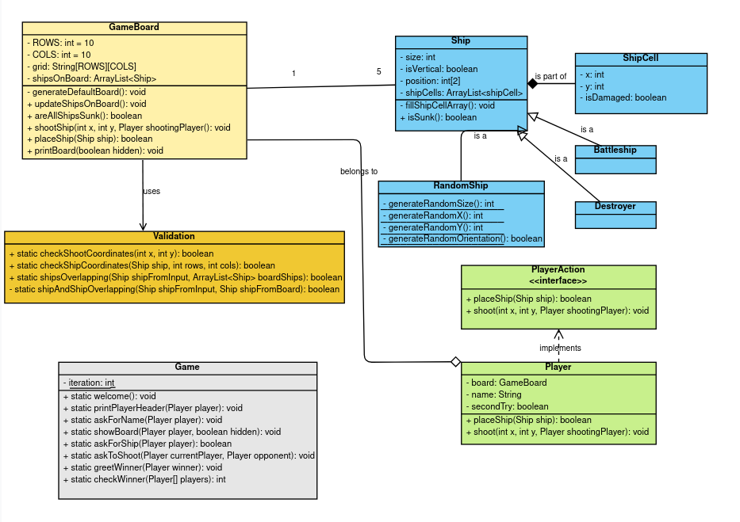

# Battleship

## Description
Battleship is an Object-Oriented Programming (OOP) game developed as a school project.
The game is written in Java and follows the classic rules of the Battleship board game.

## Table of Contents
1. [Class diagram](#class-diagram)
1. [Installation](#installation)
2. [Usage](#usage)
3. [Player infos](#player-infos)


## Class diagram



## Installation
To run this project locally, follow these steps:

1. Clone the repository:
    ```bash
    git clone https://github.com/kostimo/Battleship.git
    ```
2. Navigate to the project directory:
    ```bash
    cd Battleship
    ```
3. Compile the Java files:
    ```bash
    javac -d bin src/*.java
    ```
4. Run the game:
    ```bash
    java -cp bin Main
    ```
   
## Usage
After running the game, follow the on-screen instructions to place your ships and
start playing against another player. The objective is to sink all of the opponent's
ships before they sink yours.


## Player infos
There are two types of ship you can place. The `battleship` has a size of four and the `destroyer` has a size of two.
When placing a ship, you will be asked for the **ship type** you want to place, for the **orientation** and for the
**coordinates.**

- If you type `r` for **ship type**, a random ship will be created

- If you enter something else than the values you're asked to enter for the ship's type, it will automatically be a
  destroyer.

- If you enter something else then the values you're asked to enter for the ship's orientation, it will automatically be
  placed horizontally.

Ships can be placed directly next to each other.  
A ship is placed at the entered coordinates.

- If it's horizontal, it will be placed from the starting coordinate to the right.

- If it's vertical, it will be placed from the starting coordinate to the bottom.
  Ships can be placed directly next to each other.

- If you're trying to place a ship outside the game board or the ship can't be placed at the entered coordinates because
  it would leave the board or overlap with other ships, you will be asked again to place a ship.
